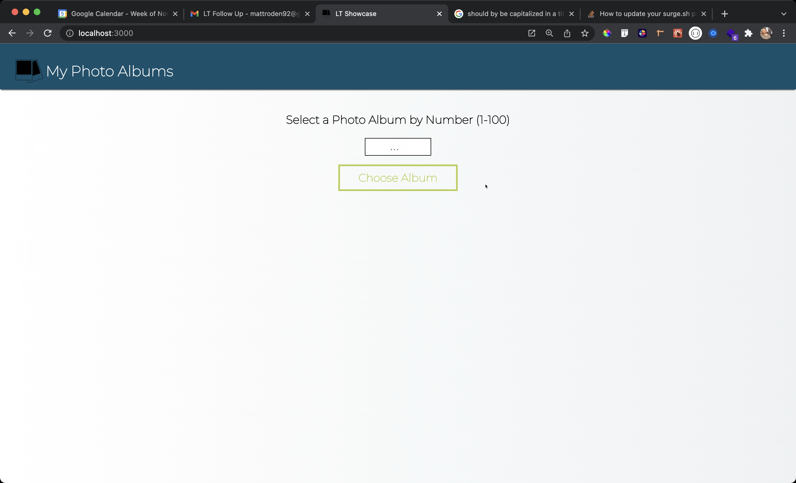
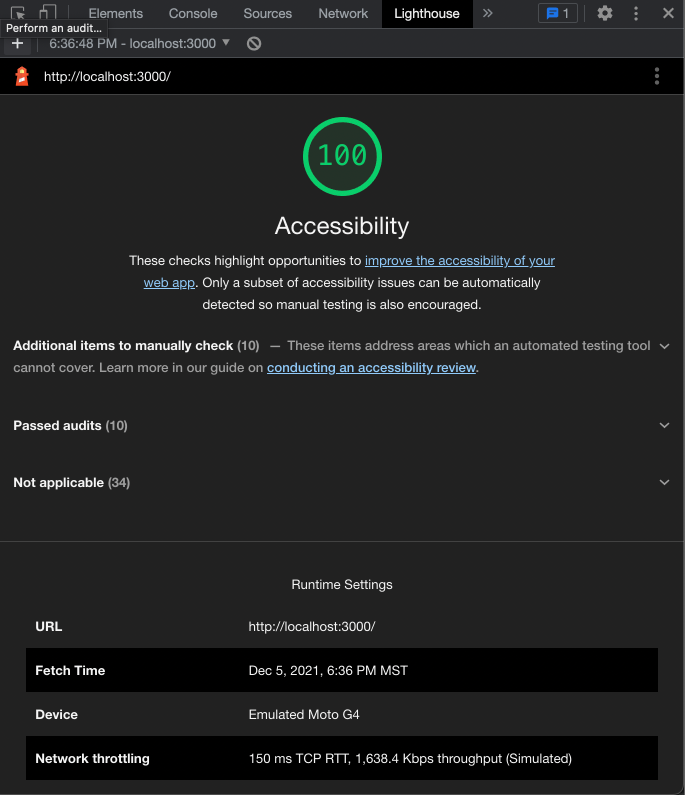
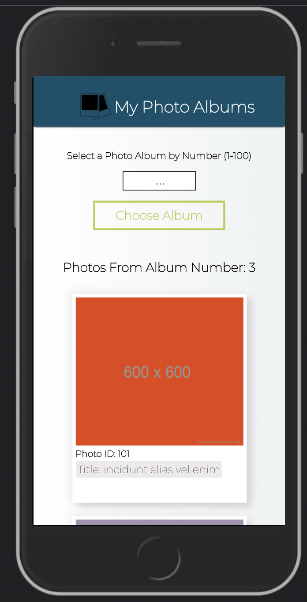
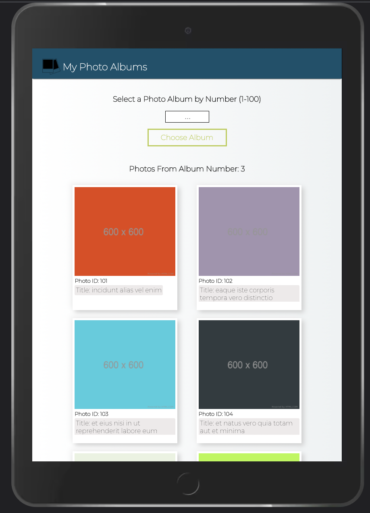
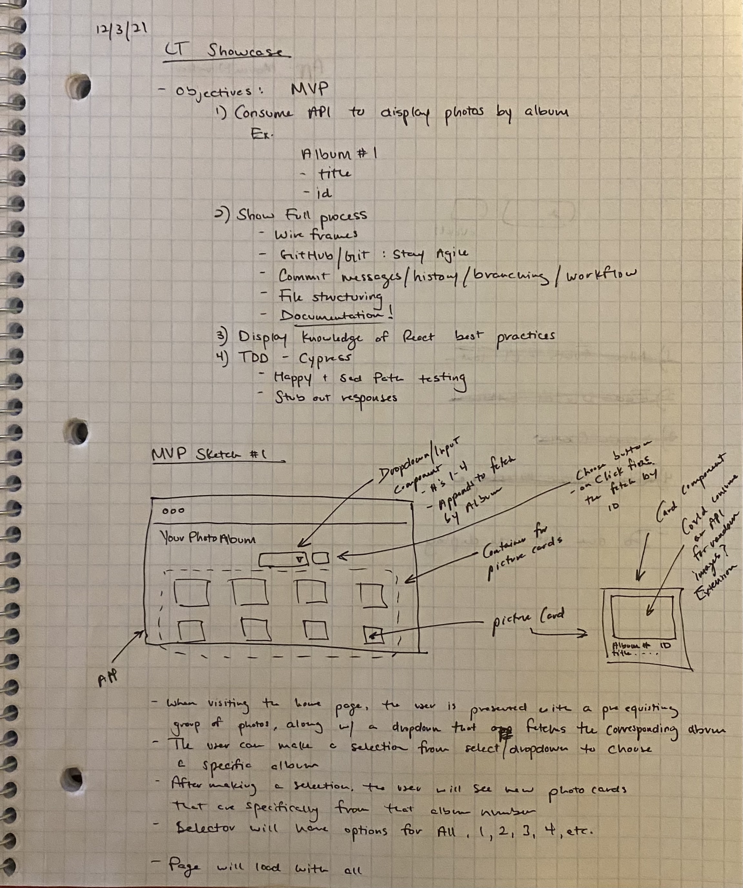
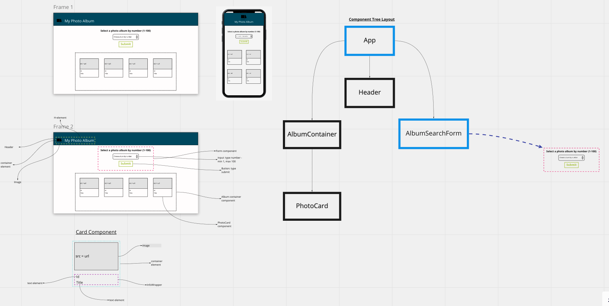

<h1 align='center'>My Photo Album</h1>

<a href='https://mroden-lt-showcase.surge.sh/'><h3 align='center'>Deployment Link</h3></a>

### Abstract:

My Photo Album is a web application that allows a user to view a collection of photos and filter specifically what album they would like to view. 

### Tech Stack:

React, JavaScript, Cypress, GSAP Animation Library, Material UI Component Library, Git, GitHub, NPM

### Setup Instructions:

  + Fork this repo by clicking the ```Fork``` button in the upper right of this page
  + Clone your new repo down to your local machine in your chosen directory by running ```git clone <remote repo url>``` and then ```cd``` into project directory
  + Type ```npm install``` into the command line to install all dependencies
  + Type ```npm start``` into to the command line to start the React app. A browser window will appear running a local host url

  ##### Testing Setup: 
  + In ```main``` of project directory, run ```npm run cypress``` in the command line
  + A browser will appear, once it does, click on ```userFlows_spec.js``` and the tests will begin running automatically

### Demo:



### Testing:

- End to End testing was done using the Cypress testing library.


### Responsiveness & Accessibility:

- This application was designed and built with responsivesness and accessibility in mind. It achieved a 100% Lighthouse Accessibility score and is responsive acrosse desktop, tablet and mobile devices.

<div display='flex' >
  
  
  
</div>


### Process:

- The app architecture and design was first sketched by hand and then transferred into wireframes on a Miro board
- GitHub Projects were used to plan out development steps and Issues were assigned to each step along the way in order to stay agile in the development process

<div display='flex'>
  
  
</div>

<p align='center'>This project was built as an interview challenge for Lean TECHniques</p>
